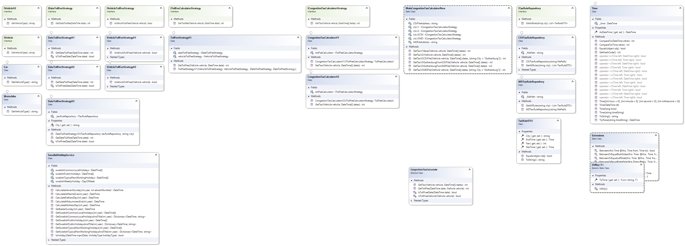

# Congestion Tax Calculator Assignment
This was a complete assignment for entire software engineering process including analysis, design, coding, testing, documenting, deployment and so on!

I hope my manager never repeat this to avoid me using Git because I loose some changes after installing some plug-ins, and also I have to add more time in this limited period to finish his/her new order for other cities at the last moment!

I know that I should check the tests more and make more documents and tests, but I want to send this version as you said I should finish the entire course in 4 days, even I don't know that this step will be added to the course after role selection and it is very time-consuming. I have a limited time in these 2 days, but I try to do my best. I will complete this assignment as I can and upload new versions in my Github, but now I will send the current version for you.

Please consider the following hints:
1. I review codes and insert many TODO comments in the code that should be checked by the team ordered by their sequence.

2. I document many classes and methods using ChatGPT and made a MD file as readme.md and an HTML version (and XML version) for other developers.
[Help Document in MD format](./Readme-HelpDocument.md) & [Help Document in HTML format](./Readme-HelpDocument.html)
3. I was careful to use spell checker in my VS2022 to avoid misspells but there may be some grammatical errors in my document that I have to find a plug-in for this purpose too (like Ginger or Grammarly that can be used in windows and Word).
4. Unfortunately, there is no class designer for .net core project built-in VS2022, so we can use other tools like SparxEA to more visualize the structures and designs for sharing. I made a new version of project for .NetFramework and link (not copy), the current source to make a class diagram, too.

5. I save code metrics as image and CSV file to can be used without VS IDE and everybody can check the quality of the codes but I think the codes can be improved more to have better metrics.

6. I build many unit and integration tests for many important classes but they need more review. Besides I use all famous test framework including MSTest, NUnit and xUnit for a class -called `VehicleTollFeeStrategyV2Tests`-, but I just have time to make more test for xUnit project. The result of code coverage and bugs can be see in `Code Coverage` image file. I will try to improve the code, correct the bugs and send new version as soon as I can.


7. I implement Bonus scenario and check it using unit and integration tests. There are two example input file for CSV and MD files (like the specification format) to test this scenario in the main folder -`netcore`- and the tests use these files, too.
8. Maybe it be better to have different projects for presentation, application and other layers but as my junior college don't make any structure for the project and my manager don't say how, where, why, what, are the requirements, I put all files (even sample input files) in the same project.
9. I usually use SonarLint plug-in to avoid code smell and I usually check all of its hint in my code and do review as much as I can and be reasonable for me.

# 2. Usage

To use the `MainCongestionTaxCalculatorNew` -the new version of `CongestionTaxCalculator`-, simply call the `GetTax` method and pass in a vehicle and an array of dates:

```csharp
var vehicle = new Car();
var dates = new DateTime[] { DateTime.Parse("2023-07-06 06:00:00"), DateTime.Parse("2023-07-06 07:30:00") };
int tax = MainCongestionTaxCalculatorNew.GetTaxV1Base(vehicle, dates);
int tax = MainCongestionTaxCalculatorNew.GetTaxV2(vehicle, dates); // this version is built after doing code reviews
int tax = MainCongestionTaxCalculatorNew.GetTaxV3GothenburgFromCSVFile(vehicle, dates); // this version is an improved version of V2 after adding Bonus Scenario
int tax = MainCongestionTaxCalculatorNew.GetTaxV3GothenburgFromMDFile(vehicle, dates); // this version is an improved version of V2 after adding Bonus Scenario

```

In the above example, we create a new Car instance and an array of dates. We then call the GetTax method of the CongestionTaxCalculator static class, passing in the vehicle and dates parameters. The method returns the total tax for those dates, which we store in the tax variable.

# 3. License
This code is licensed under the MIT license. See the LICENSE file for more information.